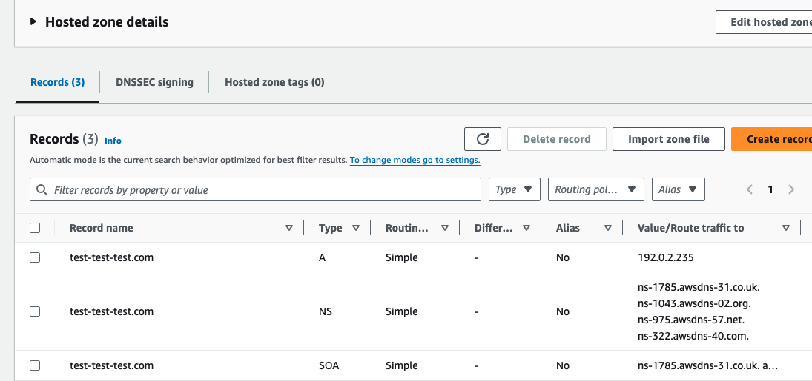
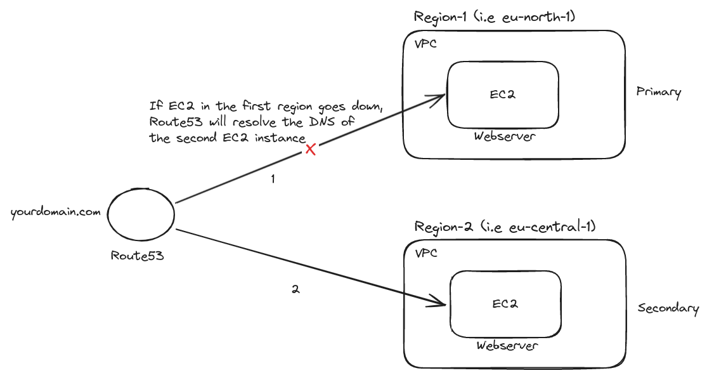

### What it is the AWS Route 53?

- It is a DNS as a service.

- It allows users to route internet traffic to various AWS services and resources, as well as to manage domain registration and DNS health monitoring.

- 
 
### Why do we need AWS Route 53?

- To effectively manage domain names and route internet traffic to AWS resources, ensuring accessibility, reliability, and scalability for web applications and services.

### How can we use it?

- Domain Registration
   - purchase or use it from outside
   - put it to Hosted Zones (take all the DNS records)

- Hosted Zone:
   - 
      - A Hosted Zone is like a container that holds all the DNS records for a domain.
      - An NS (Name Server) Record points to the servers responsible for translating your domain into IP addresses.
      - An A Record can point to a specific IP address or use an Alias to route traffic to AWS resources like CloudFront, S3, or Elastic Load Balancers.
      - A CNAME (Canonical Name) Record points one domain name to another domain name, essentially acting as an alias for the original domain, instead of pointing to an IP address directly.

      - Private Hosted Zone 
        - Route the traffic in an Amazon VPC 
      - Public Hosted Zone 
        - Route the traffic on the Internet 

- Route 53 also make "Health Checks"

### Route53 DNS Failover across AWS Regions

- 

### Resources

1. https://aws.amazon.com/route53/

2. [Route53 - Abhishek Veeramalla](https://www.youtube.com/watch?v=6BoTfTtNsGU)

3. [What is Amazon Route 53? AWS Route 53 Tutorial](https://intellipaat.com/blog/what-is-aws-route53/)

4. [AWS VPC and Networking in depth - Chetan Agrawal](https://www.udemy.com/course/networking-in-aws/)

5. [AWS Route 53 Course - Rahul Wagh](https://www.youtube.com/watch?v=tXgOSt80Mtg)
