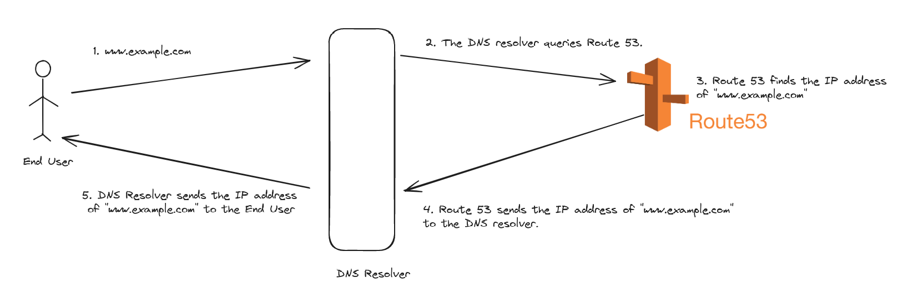

# WIP

### What it is the AWS Route 53?

- It is a DNS as a service.

- It allows users to route internet traffic to various AWS services and resources, as well as to manage domain registration and DNS health monitoring.

- 
 
### Why do we need AWS Route 53?

- To effectively manage domain names and route internet traffic to AWS resources, ensuring accessibility, reliability, and scalability for web applications and services.

### How can we use it?

- Domain Registration
   - purchase or use it from outside
   - put it to Hosted Zones (take all the DNS records)

- Route 53 also make "Health Checks"

### Resources

1. https://aws.amazon.com/route53/

2. [Route53 - Abhishek Veeramalla](https://www.youtube.com/watch?v=6BoTfTtNsGU)

3. [What is Amazon Route 53? AWS Route 53 Tutorial](https://intellipaat.com/blog/what-is-aws-route53/)